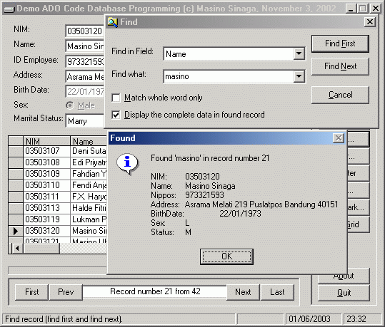



## A Complete ADO Code Database Programming \(Updated\)

### Description

Confused how to make a database programming using ADO Code? This project shows you how to make a complete ADO Code database programming with: navigation (move first, move next, move previous, move last), add, update, delete, cancel, refresh, find first, find next, filter, unfilter, sort (ascending-descending), bookmark, and adjust datagrid's column. This project uses reference "Microsoft ActiveX Data Objects 2.0 Library" and database Microsoft Access 97.

I made this project by using "VB Application Wizard" in Visual Basic's Project Type Dialog Box and I choose "ADO Code" and "Master-Detail" through "Data Access From". Then I modified the code by adding find, filter, sort, and bookmark procedure - each of them in one form. I made findfirst and findnext procedure because there is no findfirst and findnext in ADO. I added "Match whole word only" checkbox in Find form, also in filter procedure/form. I made "Bookmark" procedure, too. I didn't use ADO's bookmark property.

The first time I posted this code, I used Indonesia language for comments in source code. Now I have translated them to English, include Label, Field Name, Help, etc. I hope this will help you to understand the code. Any comments and votes would be appreciated. Enjoy!!!
 
### More Info
 

             |
---                |---
**Submitted On**   |2003-06-02 16:42:32
**By**             |[Masino Sinaga](https://github.com/Planet-Source-Code/PSCIndex/blob/master/ByAuthor/masino-sinaga.md)
**Level**          |Intermediate
**User Rating**    |4.8 (324 globes from 68 users)
**Compatibility**  |VB 6\.0
**Category**       |[Databases/ Data Access/ DAO/ ADO](https://github.com/Planet-Source-Code/PSCIndex/blob/master/ByCategory/databases-data-access-dao-ado__1-6.md)
**World**          |[Visual Basic](https://github.com/Planet-Source-Code/PSCIndex/blob/master/ByWorld/visual-basic.md)
**Archive File**   |[A\_Complete159607632003\.zip](https://github.com/Planet-Source-Code/masino-sinaga-a-complete-ado-code-database-programming-updated__1-45892/archive/master.zip)

